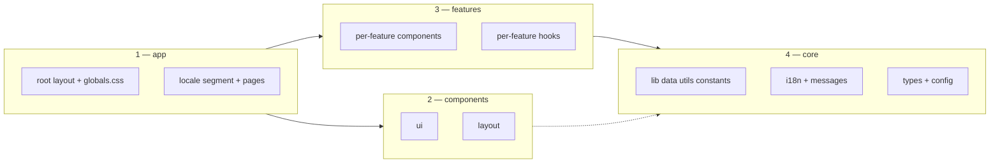

# Explore SOUS — engineering guide

Conventions for layout, naming, and git. **Next.js App Router** → [`.cursor/rules/nextjs-16-conventions.mdc`](./nextjs-16-conventions.mdc). **React 19** → [`.cursor/rules/react-19-conventions.mdc`](./react-19-conventions.mdc). **Styling / design tokens** → [`.cursor/rules/explore-sous-styling.mdc`](./explore-sous-styling.mdc).

**Product context:** discovery frontend (vendors, pickup / delivery / reservations). Default locale **nl**; **en** later. Data will come from SOUS; until then `lib/data/*` mocks keep types stable.

---

## Repository structure

Diagram (renders in GitHub / Markdown previews):

| Lane | Under `src/` | Role |
|------|----------------|------|
| 1 | `app/` | Routes only: `layout`, `page`, `loading`, `error`; public URLs under `[locale]`. |
| 2 | `components/ui`, `components/layout` | Shared presentational UI; **no** domain rules. |
| 3 | `features/<name>/` | Vertical slices (`components/`, `hooks/`, optional local types). |
| 4 | `lib/`, `i18n/`, `messages/`, `types/`, `config/` | Data access, i18n, shared domain types, env-safe config. |

**Dependency rule:** `app` → `components` / `features`. `features` → `components/ui`, `lib/*`, `types`. `components/ui` must not import `features`. **Data:** pages and features use `lib/data/*` only (no raw mock JSON in routes).

**Copy:** user-visible strings live in `messages/*` (keys in components), not hard-coded prose.

---

## Nomenclature

| Item | Convention | Example |
|------|------------|---------|
| React components | PascalCase | `VendorCard.tsx` |
| Other TS/TSX modules | kebab-case | `get-vendors.ts` |
| Hooks | `use` + PascalCase | `useSearchFilters.ts` |
| Folders | kebab-case | `features/vendor-profile/` |
| URL segments | kebab-case | `some-vendor`, not `someVendor` |
| Types / props | `interface` for object shapes; PascalCase name | `Vendor`, `VendorCardProps` |
| Constants | `SCREAMING_SNAKE` or `as const` objects | `DEFAULT_PAGE_SIZE` |
| i18n keys | `feature.section.key` | `vendors.card.cta` |

---

## Git

Commits: **[Conventional Commits 1.0.0](https://www.conventionalcommits.org/en/v1.0.0/)** — `type[optional scope]: description` (`feat`, `fix`, `docs`, `refactor`, `chore`, …). Breaking: `!` after type/scope and/or `BREAKING CHANGE:` footer.

Branches: `type/short-kebab-topic` (e.g. `feat/vendor-search`, `fix/locale-redirect`). Squash-merge: keep the **squashed** title conventional.

---

## Doc maintenance

Update this file in the same PR when layout or team conventions change.
